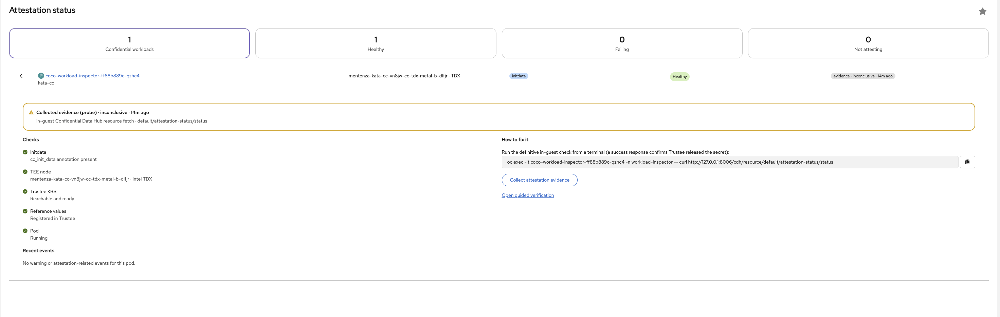
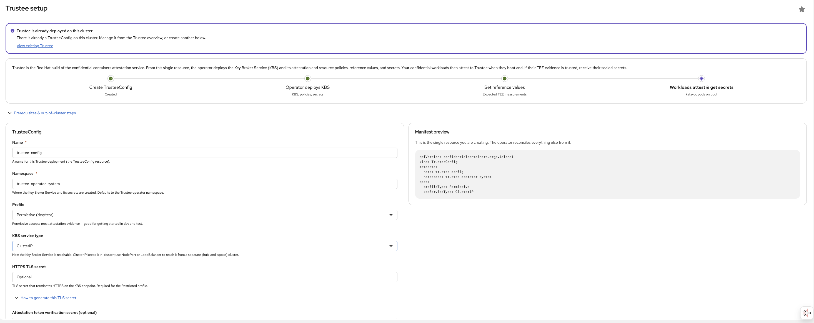
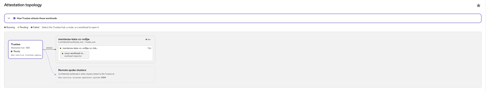

# Trustee (Attestation) — OpenShift Console plugin

[](https://github.com/makentenza/trustee-openshift-console-plugin/actions/workflows/build-push.yml)

> [!WARNING]
> **Unofficial and unsupported.** This is a community/personal project — **not** an official Red Hat
> or OpenShift product, and **not** covered by Red Hat support, subscriptions, or any SLA. It is
> provided **as-is** under the Apache-2.0 license. Validate in a
> non-production environment before use, at your own risk.

`trustee-openshift-console-plugin` is an OpenShift Console **dynamic plugin** to **deploy, manage, and
observe the Red Hat build of Trustee** — the confidential containers attestation service. From a
single `TrusteeConfig` the operator stands up the Key Broker Service (KBS) plus its attestation and
resource policies, reference values, and the secrets it delivers to attested workloads.

> **Two operators total — Trustee ships from its own.** This plugin is delivered by the **Trustee
> operator** (separate). The **OSC operator** (`openshift/sandboxed-containers-operator`) ships the
> *other two* plugins from a single operator: **Sandboxes** (`osc-openshift-console-plugin`) and, via
> the `confidential:true` feature gate, **Confidential Containers**
> (`coco-openshift-console-plugin`). So there is no "CoCo operator" — confidential containers and
> attestation are decoupled at the operator level, which is why the attestation service can run on a
> different cluster (hub-and-spoke).
>
> **Confidential containers live in a separate plugin.** Enabling the `kata-cc` runtime, labeling
> TEE nodes, building `initdata`, and running confidential workloads is handled by
> **[`coco-openshift-console-plugin`](https://github.com/makentenza/coco-openshift-console-plugin)**.
> This plugin owns the *attestation* side: it exposes the KBS URL the workload side needs, and
> consumes the reference values (PCR8) the workload side produces.

## What it covers

A single **Trustee (Attestation)** admin nav section (gated by `console.flag/model` on `TrusteeConfig`),
organized as **deploy / manage / observe**:

- **Deploy** — a `TrusteeConfig` wizard: Permissive (dev/test) or Restricted (production) profile,
  KBS service type (ClusterIP / NodePort / LoadBalancer), and HTTPS / attestation-token TLS secrets.
  It detects an already-deployed Trustee and surfaces the out-of-cluster prerequisites (HTTPS cert,
  the `veritas` tool for reference values, image-signing keys, Intel PCCS key, NVIDIA NRAS).
- **Manage** — `TrusteeConfig` resource tabs: **Policies** (resource + attestation policies),
  **Reference values** (RVPS), **Delivered secrets**, and **GPU attestation** (the NVIDIA NRAS remote
  verifier).
- **Observe** — a Trustee **overview**, and a per-pod **attestation verify** page plus a *Verify
  attestation* action on confidential (`kata-cc`) pods.

### CRD group/version

Targets the Red Hat build of Trustee CRDs as installed on-cluster — **`TrusteeConfig` and `KbsConfig`
at `confidentialcontainers.org/v1alpha1`** (not `trustee.confidentialcontainers.org/v1`). The
high-level `TrusteeConfig` is the resource you create; the operator generates `KbsConfig` and the
config maps / secrets from it.

### Same cluster or separate

Running Trustee on a separate trusted cluster (hub-and-spoke) is a best practice but **not required** —
Trustee and confidential containers can run on the **same cluster**. `ClusterIP` keeps the KBS
in-cluster (the co-located default); use `NodePort`/`LoadBalancer` to reach it from a separate
cluster.

## Screenshots

### Attestation status


### Trustee setup


### Attestation topology


## Stack

Matches `coco-openshift-console-plugin` / `osc-openshift-console-plugin` (OCP **4.22**): React **18**,
PatternFly 6.4, `@openshift-console/dynamic-plugin-sdk` `4.22-latest`, `react-router` v7 (import
`Link`/`useNavigate`/`useParams` from `react-router`), `swc-loader`, Yarn 4.14.1.

## Develop

```bash
yarn install
yarn start          # plugin dev server on :9001
yarn start-console  # OpenShift console in a container (requires `oc login`)
# open http://localhost:9000
```

- `yarn lint` — eslint + stylelint (`--fix`)
- `yarn build` — production bundle
- `yarn test` — Jest unit tests for the pure helpers in `src/utils/*`
- `yarn i18n` — regenerate `locales/en/plugin__trustee-openshift-console-plugin.json`

## Conventions

- i18n namespace `plugin__trustee-openshift-console-plugin`; CSS class prefix `trustee-openshift-console-plugin__`.
- PatternFly `--pf-t--*` tokens only (no hex/named colors — dark-mode safe).
- Functional components; hooks wrap `useK8sWatchResource`; types extend `K8sResourceCommon`.

## Cross-plugin ConfigMap contracts

Trustee and the OSC-shipped CoCo plugin update on **independent operator release trains** but exchange
two ConfigMaps. Each carries a `schema` data field stamped with
`SHARED_CONFIGMAP_SCHEMA_VERSION` (currently `"1"`, in `src/k8s/resources.ts`); readers tolerate a
missing or older value (treat as `1`) and ignore a newer one they don't understand, so an operator
skew degrades gracefully instead of misparsing.

| ConfigMap | Label | Written by | Read by | Keys |
| --- | --- | --- | --- | --- |
| `<tc>-shared-initdata` | `trustee.attestation/shared-initdata=true` | **Trustee** (Initdata tab) | CoCo (same-cluster convenience) | `schema`, `cc_init_data`, `kbs-url`, `pcr8`, `README` |
| `attestation-evidence-<pod>` | `trustee.attestation/evidence=true` | CoCo (evidence sidecar / probe) | **Trustee** (Attestation status) | `evidence.json` (`EvidenceRecord`, incl. `schema`) |

These are conventions across two repos — keep the label strings and the schema constant in sync if you
change either side.
